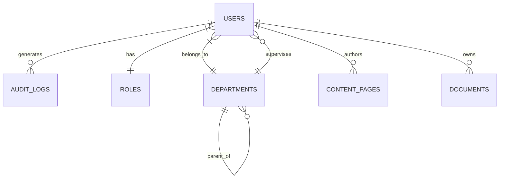

# Phase 18 & 19: Database Design & ER Diagram

## Project: Nursing Administration Portal
**Client:** Jazan Specialty Hospital

---

## Phase 18: Database Design

The system utilizes **Firebase Firestore**, a NoSQL document database. Data is denormalized where read performance is prioritized over write duplication, which is appropriate for a portal where content (policies, news) is read thousands of times but written rarely.

### 18.1 Collections Architecture

#### `users`
*   `uid` (String, PK - Maps to Firebase Auth)
*   `name` (String)
*   `email` (String)
*   `role_id` (String, FK to `roles`)
*   `department_id` (String, FK to `departments`)
*   `avatar_url` (String)
*   `is_active` (Boolean)
*   `created_at` (Timestamp)

#### `roles`
*   `id` (String, PK)
*   `name` (String) - e.g., "Admin", "Nurse"
*   `permissions` (Array of Strings) - e.g., `["manage_users", "publish_news", "view_reports"]`

#### `departments`
*   `id` (String, PK)
*   `name` (String)
*   `description` (String)
*   `supervisor_id` (String, FK to `users`)
*   `parent_department_id` (String, FK - for hierarchical structures)

#### `content_pages` (News, Announcements, Static Pages)
*   `id` (String, PK)
*   `title` (String)
*   `slug` (String, Unique)
*   `body_html` (String)
*   `type` (String) - 'news', 'event', 'page'
*   `author_id` (String, FK to `users`)
*   `status` (String) - 'draft', 'published', 'archived'
*   `published_at` (Timestamp)
*   `tags` (Array of Strings)

#### `documents` (Policies, Forms, Guidelines)
*   `id` (String, PK)
*   `title` (String)
*   `category` (String)
*   `file_url` (String - link to Firebase Storage)
*   `version` (String)
*   `status` (String) - 'draft', 'pending_review', 'active', 'archived'
*   `valid_from` (Timestamp)
*   `valid_to` (Timestamp)
*   `owner_id` (String, FK to `users`)

#### `audit_logs`
*   `id` (String, PK)
*   `user_id` (String, FK)
*   `action` (String) - e.g., 'UPDATE_POLICY', 'LOGIN'
*   `resource` (String) - e.g., 'documents/doc123'
*   `timestamp` (Timestamp)
*   `ip_address` (String)

### 18.2 Indexing Strategy
*   **Composite Indexes:** Required for queries filtering by status and ordering by date (e.g., `content_pages` where `status == 'published'` ORDER BY `published_at` DESC).
*   **Array-Contains:** Used for searching documents by tags.

---

## Phase 19: Entity Relationship Diagram (ERD - Conceptual)

*Note: As Firestore is NoSQL, this diagram represents the logical relationships and foreign key references maintained at the application level.*

*   A **User** belongs to one **Role** and one **Department**.
*   A **Department** can have a Supervisor (who is a **User**).
*   **Users** author **Content Pages** and own **Documents**.
*   Every action by a **User** generates an **Audit Log**.
