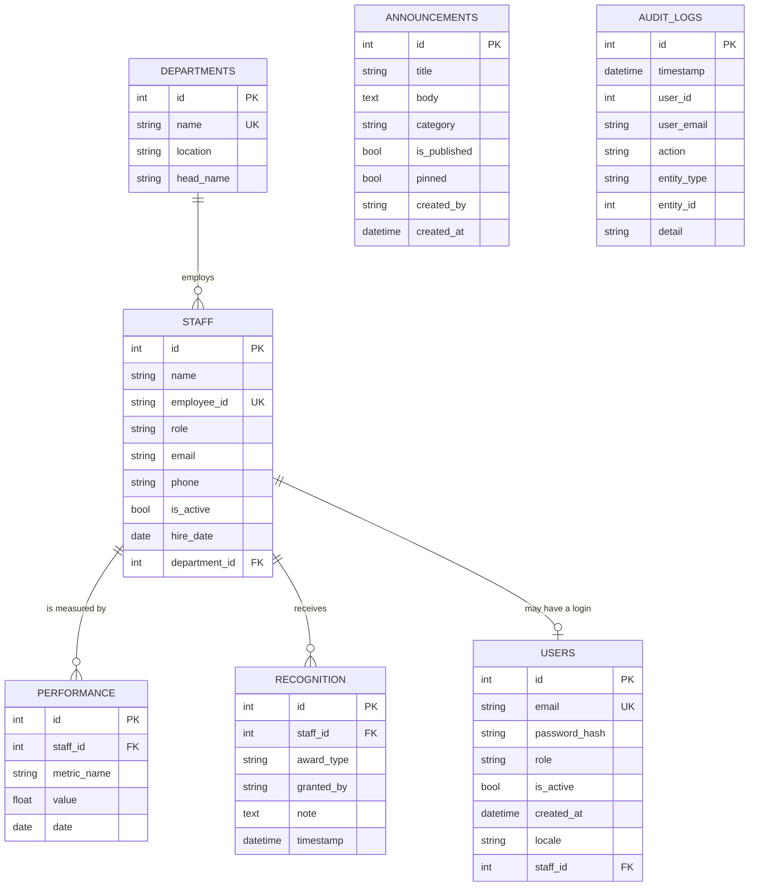

# Document 22: ER Diagram (Entity-Relationship)
## Project: Nursing Executive Administration System
**Client:** Jazan Specialty Hospital (JSH)
**Phase:** 5 — System Design
**Version:** 2.0 · **Status:** CURRENT — matches the implemented schema

> **Revision note (v2.0):** v1.0 modelled Firestore collections (User, Department, Document,
> News, Schedule) with NoSQL reference arrays. The delivered schema is relational with real
> foreign keys, and the entity set differs: there is no `Document` or `Schedule` table, and
> `Performance`, `AuditLog`, and a separate `User`/`Staff` split were added.

---

## 1. Entities (الكيانات)

| Entity | Table | Purpose |
|---|---|---|
| Department | `departments` | Organisational unit |
| Staff | `staff` | A nurse / nursing-administration employee |
| User | `users` | A **login account** (distinct from the staff record) |
| Performance | `performance` | A metric measurement for a staff member |
| Recognition | `recognition` | An award granted to a staff member |
| Announcement | `announcements` | News item, announcement, or event |
| AuditLog | `audit_logs` | Append-only record of security-relevant actions |

**Staff vs. User is the key modelling decision:** a *staff member* is an HR record that exists
whether or not that person can log in; a *user* is a credential. Most staff have no login, and
an account (e.g. a system administrator) may have no staff profile. They are linked
optionally, at most one-to-one.

## 2. Relationships (العلاقات)

- **Department 1 : N Staff** — a staff member belongs to exactly one department;
  deleting a department cascades to its staff. *(The application additionally blocks deleting
  a department that still has staff, so the cascade is a safety net, not the normal path.)*
- **Staff 1 : N Performance** — many measurements over time; cascade delete.
- **Staff 1 : N Recognition** — many awards over time; cascade delete.
- **Staff 1 : 0..1 User** — a staff profile may be linked to at most one login
  (`users.staff_id`, `ON DELETE SET NULL`; uniqueness enforced in the application layer).
- **Announcement** and **AuditLog** are standalone by design — they store author/actor
  identity as text so records survive deletion of the referenced person.

## 3. Diagram (Mermaid)

`ANNOUNCEMENTS` and `AUDIT_LOGS` are shown as entities but intentionally carry no foreign
keys (see §2).

## 4. Cardinality Summary

| From | To | Cardinality | FK column | On delete |
|---|---|---|---|---|
| Departments | Staff | 1 : N | `staff.department_id` | CASCADE |
| Staff | Performance | 1 : N | `performance.staff_id` | CASCADE |
| Staff | Recognition | 1 : N | `recognition.staff_id` | CASCADE |
| Staff | Users | 1 : 0..1 | `users.staff_id` | SET NULL |
