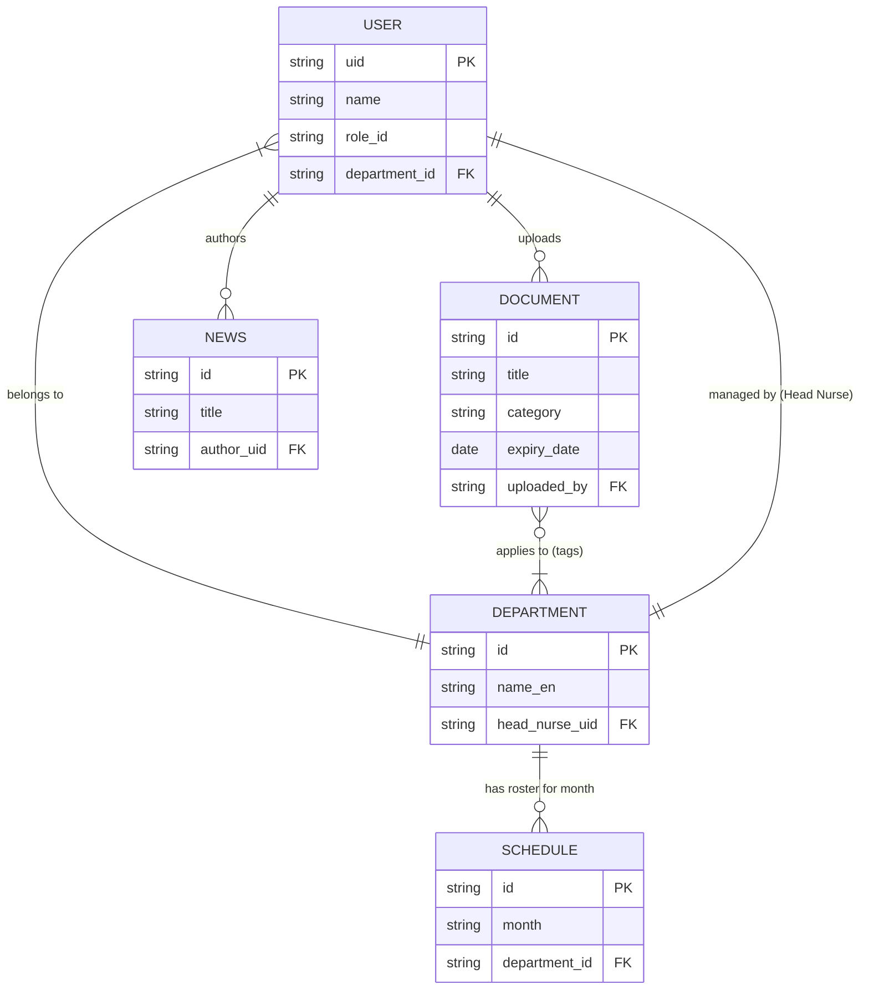

# Document 22: ER Diagram (Entity-Relationship)
## Project: Nursing Administration Portal
**Client:** Jazan Specialty Hospital (JSH)
**Phase:** 5 - System Design
**Version:** 1.0

---

## 1. Overview (نظرة عامة)
While Firestore is a NoSQL database, visualizing the conceptual relationships between data entities is crucial for understanding the system architecture. This document provides a textual representation of the Entity-Relationship (ER) model.

## 2. Conceptual ER Model (النموذج المفاهيمي)

### Entities (الكيانات)
1.  **User (المستخدم)**
2.  **Department (القسم)**
3.  **Document (الوثيقة - Policy/Form)**
4.  **News (الخبر/الإعلان)**
5.  **Schedule (الجدول)**

### Relationships (العلاقات)

*   **User to Department (Assignment):**
    *   A `User` belongs to exactly **one** `Department` (1:1).
    *   A `Department` can have **many** `Users` assigned to it (1:N).

*   **User to Department (Management):**
    *   A `Department` is managed by exactly **one** `User` (Head Nurse) (1:1).

*   **Document to Department (Applicability):**
    *   A `Document` (e.g., a policy) can apply to **many** `Departments` (M:N).
    *   A `Department` can have **many** `Documents` applicable to it.
    *   *(In NoSQL, this M:N relationship is resolved by storing an array of Department IDs inside the Document entity).*

*   **User to Document (Ownership/Upload):**
    *   A `Document` is uploaded/owned by exactly **one** `User` (Quality Officer) (1:1).
    *   A `User` can upload **many** `Documents` (1:N).

*   **User to News (Authorship):**
    *   A `News` article is authored by exactly **one** `User` (1:1).
    *   A `User` can author **many** `News` articles (1:N).

*   **Department to Schedule (Rostering):**
    *   A `Schedule` belongs to exactly **one** `Department` (1:1).
    *   A `Department` can have **many** `Schedules` over time (one per month) (1:N).

## 3. Diagram Representation (Mermaid Syntax)
*(This syntax can be used in Markdown viewers that support Mermaid.js to generate a visual diagram).*

